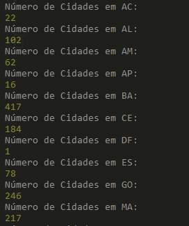
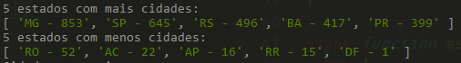
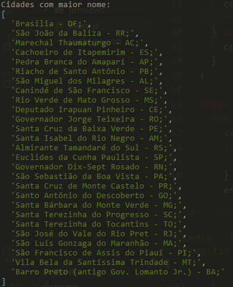
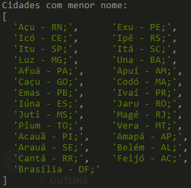

# BootcampIGTI-T2-City-States-API

Second practice project of the IGTI Full Stack Developer Bootcamp.

This project's goal is to pratice files and data manipulation in Node.js. 

It grabs data from the .json files in the 'data' folder, creates some new .json files and logs some statistics about the cities and states, like:

City count in each state:

The 5 states with most and least cities:

A list with the city with longest name for each state:

A list with the city with shortest name for each state:

